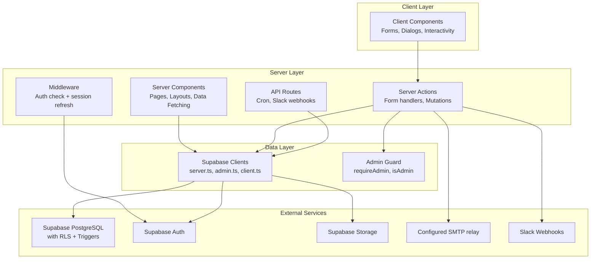
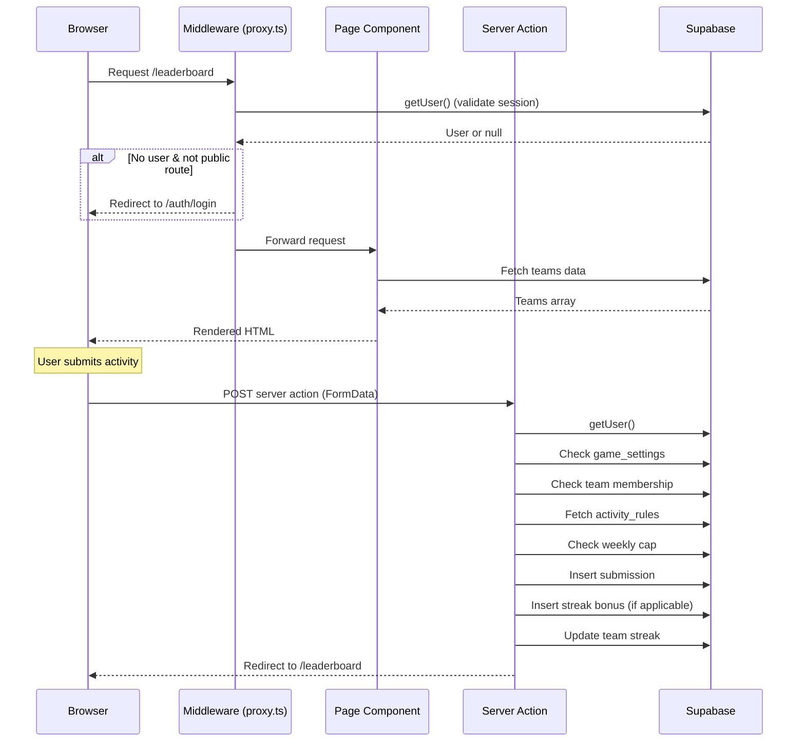
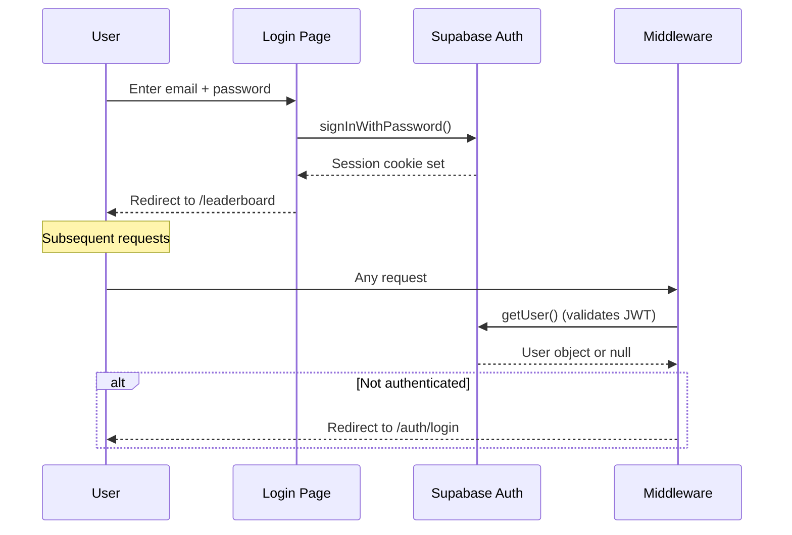

# Architecture

> **Purpose:** Document the architectural style, boundaries, patterns, and technical decisions.
> **Audience:** Developers and AI agents making changes to the codebase.
> **Source of truth:** All source code files, `middleware.ts`, `lib/` directory, `app/` directory.
> **Last reviewed:** 2026-09-04

## Architectural Style

Spartan Games is a **server-first Next.js App Router application**. The vast majority of pages are React Server Components that fetch data directly from Supabase. Mutations use Next.js Server Actions (`"use server"` functions) that redirect on completion. Client components are used sparingly for interactive forms, dialogs, and theme switching.

## High-Level System Context

```mermaid
graph TB
    User[Browser / installed web app] -->|HTTPS| Vercel[Vercel-hosted Next.js]
    Vercel -->|Middleware| Proxy[lib/supabase/proxy.ts]
    Proxy -->|Session check| Supabase[Supabase<br/>PostgreSQL + Auth + Storage]
    Vercel -->|Server Actions| ServerActions[Server Action Handlers]
    ServerActions --> Supabase
    Vercel -->|API Routes| APIRoutes[/api/cron, /api/slack]
    APIRoutes --> Supabase
    APIRoutes -->|Webhook| Slack[Slack Workspace]
    ServerActions -->|SMTP| SMTP[Configured SMTP relay]
    SMTP -->|Email| User
    VercelCron[Vercel Cron] -->|GET /api/cron/finalize-week| APIRoutes
```

## Directory Responsibilities

| Directory | Runs On | Responsibility |
|-----------|---------|---------------|
| `app/` | Server + Client | Next.js App Router pages, layouts, server actions, API routes |
| `app/admin/` | Server + Client | Admin dashboard. Most pages call `requireAdmin()`; the shared layout and announcements page do not |
| `app/api/` | Server | API route handlers (cron, Slack) |
| `app/auth/` | Server + Client | Authentication pages (login, sign-up, confirm, password reset) |
| `app/leaderboard/` | Server | Leaderboard page |
| `app/submit/` | Server + Client | Activity submission form |
| `app/teams/` | Server + Client | Team management (create, join, leave, rename) |
| `app/profile/` | Server + Client | User profile with submission history and edit requests |
| `app/rules/` | Server | Rules/scoring display page |
| `components/` | Server + Client | Reusable UI components |
| `components/ui/` | Server + Client | shadcn/ui primitives and project-specific UI components |
| `lib/` | Server + Client | Shared types/utilities plus server-only Supabase and service modules |
| `lib/supabase/` | Server + Client | Supabase client factories |
| `supabase/migrations/` | Database | SQL migration files (run manually in Supabase SQL Editor) |

## Major Layers and Boundaries



## Server/Client Boundaries

### Server Components (default)
Most page components (`page.tsx`) are server components. The notable exception is `app/admin/announcements/page.tsx`, which is a client component. Data-backed server pages generally:
- Fetch data directly from Supabase using `createClient()` from `lib/supabase/server.ts`
- Use `unstable_noStore()` where they require uncached data or cookie access
- Render the HTML on the server
- Pass data as props to client components when interactivity is needed

### Client Components (`"use client"`)
Used when the component needs:
- `useState`, `useEffect`, or other hooks
- Event handlers (onClick, onChange)
- Browser APIs
- Interactive forms with client-side validation

Client component examples: `admin-tabs.tsx`, `submit-form-client.tsx`, `login-form.tsx`, `game-controls.tsx`, `theme-switcher.tsx`

### Server Actions (`"use server"`)
Used for most application mutations. Login, announcement, and edit-request actions return state or result objects in some paths; the other actions usually redirect. Common pattern:
1. Authenticate user (via `supabase.auth.getUser()` or `requireAdmin()`)
2. Validate inputs
3. Perform database operations
4. Redirect with status query parameters or return a structured result

Server actions are co-located with their pages in `actions.ts` files.

## Request Lifecycle



## Authentication Flow



## Data-Fetching Patterns

1. **Server-side fetching** — Pages call `createClient()` and query Supabase directly
2. **`unstable_noStore()`** — Used on dynamic pages to prevent static caching
3. **React `cache()`** — Used in `lib/cached-data.ts` to deduplicate repeated calls within a single request
4. **No client-side application-table fetching** — There is no SWR or React Query. Client components do call the Supabase Auth SDK for sign-up, password reset/update, and sign-out

## Validation Strategy

- **Server-side** — Business mutations validate inputs in server actions with direct checks (`Number.isFinite()`, string length, allowlists, etc.)
- **Client-side** — HTML constraints and local checks are also used. The sign-up/password flows call Supabase Auth directly from client components
- **No schema validation library** — No Zod, Yup, or similar

## Error-Handling Strategy

- **Server actions** — Use `redirect()` with `?error=` query params. Pages read search params and display `StatusBanner` components
- **Client forms** — Use `useActionState` (login) or local `useState` (sign-up, forgot-password)
- **API routes** — Return `NextResponse.json()` with appropriate status codes
- **No global error boundary** — `app/error.tsx` exists but is minimal

## Caching and Revalidation

- Most pages use `unstable_noStore()` → effectively no caching
- `revalidatePath()` is used after mutations that should refresh specific pages
- No ISR/revalidation interval is configured. The current production build reports application pages as dynamic and only the manifest/icons as static
- The `react` cache in `cached-data.ts` deduplicates within a single server request

## File Upload Architecture

1. Client compresses image using `browser-image-compression` (200KB max, 1280px max)
2. Compressed `File` is attached to `FormData`
3. Server action checks that the browser-supplied MIME type starts with `image/`, then uploads to Supabase Storage bucket `submission-proofs`
4. File path stored in `submissions.proof_image_path`
5. Pages construct a public-style URL: `{SUPABASE_URL}/storage/v1/object/public/submission-proofs/{path}`; the repository does not contain the bucket policy

There is no server-side size limit, file-signature inspection, or extension allowlist. Upload failure is logged and the activity is still created without a proof path.

## Important Technical Decisions

1. **No generated Supabase types** — Tables are queried directly without generated TypeScript types. Manual types in `lib/types.ts` define the core shapes.
2. **Database-trigger finalization contract** — Application code assumes an unversioned `finalize_week()` trigger runs when `finalize_requested` becomes `true`; the application does not calculate winners or roll up points itself.
3. **SMTP via Nodemailer** — The provider is selected through environment variables. Comments/defaults suggest Brevo/Gmail history, but the code does not use a provider-specific API.
4. **Duplicate Slack routes** — `/api/slack/command` and `/api/slack/notify` contain identical code.
5. **No configured test suite** — No test framework or test script exists. Root-level diagnostic scripts are manual utilities, not repeatable automated tests.
6. **Migrations run manually** — SQL files in `supabase/migrations/` are intended to be run via Supabase SQL Editor, not via `supabase db push` or similar CLI tooling.

## Technical Debt

- Duplicate admin check logic (inline `requireAdmin()` in `scoring/actions.ts` vs shared `lib/admin.ts`)
- Slack routes are exact duplicates
- No generated database types — manual type maintenance required
- `check_schema.js` contains hardcoded Supabase URL and publishable key
- Development artifacts committed (`data.json`, `dump.txt`, `out.txt`, `tsc_output.txt`, `dev_log.txt`)
- No automated test coverage
- Points calculation duplicated between `submit/actions.ts` and `admin/submissions/actions.ts`
- The cron route has bearer-token validation, but middleware also requires a Supabase session for that path
- Core database DDL, point-maintenance triggers, and the weekly-finalization function are not checked into migrations
- `requestSubmissionEdit()` trusts submitted team/submission IDs and relies on incomplete RLS for ownership
- Reset storage cleanup lists only the bucket root even though proofs are stored in per-user folders
- ESLint scans `.next` generated output and source-only lint still has existing errors; see `TESTING.md`

## Change this document when…

- The authentication mechanism changes
- New external services are integrated
- The data-fetching strategy changes (e.g., adding React Query)
- Server/client boundaries shift significantly
- New API routes are added
