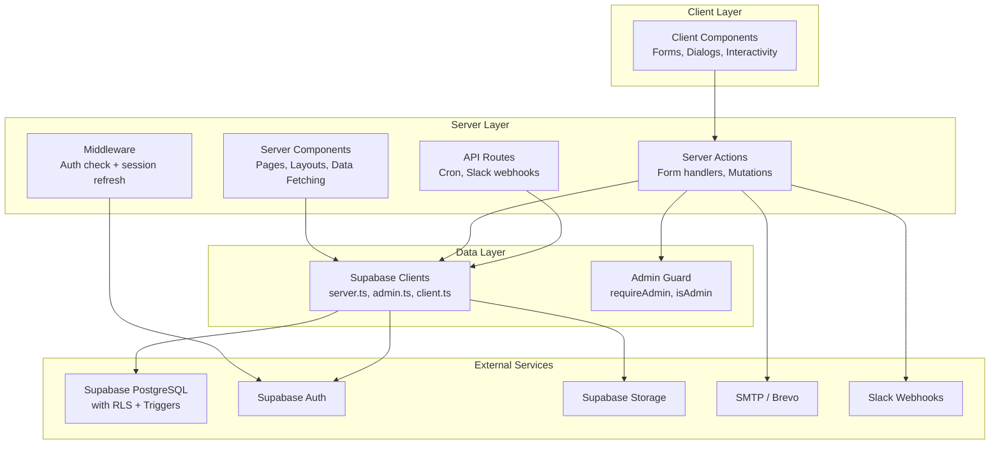
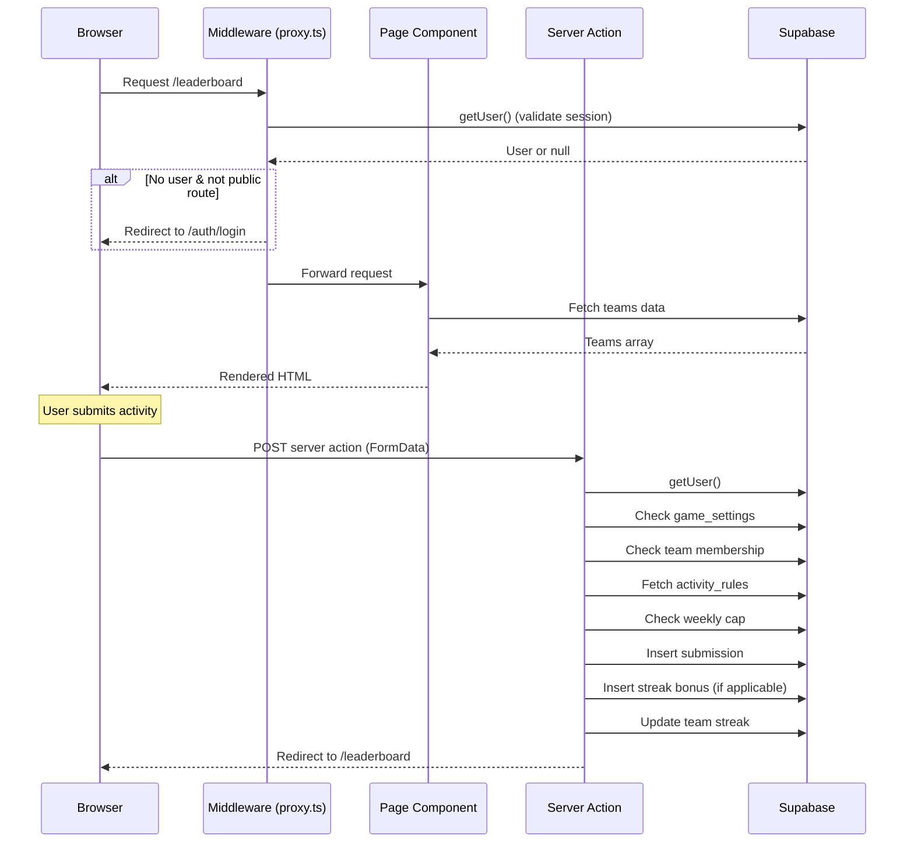
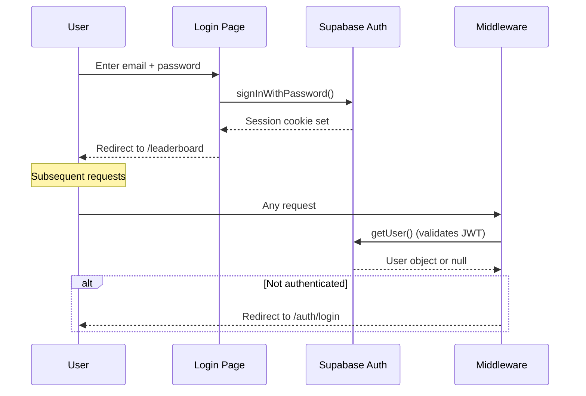

# Architecture

> **Purpose:** Document the architectural style, boundaries, patterns, and technical decisions.
> **Audience:** Developers and AI agents making changes to the codebase.
> **Source of truth:** All source code files, `middleware.ts`, `lib/` directory, `app/` directory.
> **Last reviewed:** 2026-09-03

## Architectural Style

Spartan Games is a **server-first Next.js App Router application**. The vast majority of pages are React Server Components that fetch data directly from Supabase. Mutations use Next.js Server Actions (`"use server"` functions) that redirect on completion. Client components are used sparingly for interactive forms, dialogs, and theme switching.

## High-Level System Context

```mermaid
graph TB
    User[Browser / PWA] -->|HTTPS| Vercel[Vercel Edge + Serverless]
    Vercel -->|Middleware| Proxy[lib/supabase/proxy.ts]
    Proxy -->|Session check| Supabase[Supabase<br/>PostgreSQL + Auth + Storage]
    Vercel -->|Server Actions| ServerActions[Server Action Handlers]
    ServerActions --> Supabase
    Vercel -->|API Routes| APIRoutes[/api/cron, /api/slack]
    APIRoutes --> Supabase
    APIRoutes -->|Webhook| Slack[Slack Workspace]
    ServerActions -->|SMTP| Brevo[Brevo SMTP Relay]
    Brevo -->|Email| User
    VercelCron[Vercel Cron] -->|GET /api/cron/finalize-week| APIRoutes
```

## Directory Responsibilities

| Directory | Runs On | Responsibility |
|-----------|---------|---------------|
| `app/` | Server + Client | Next.js App Router pages, layouts, server actions, API routes |
| `app/admin/` | Server + Client | Admin dashboard — all tabs require `requireAdmin()` |
| `app/api/` | Server | API route handlers (cron, Slack) |
| `app/auth/` | Server + Client | Authentication pages (login, sign-up, confirm, password reset) |
| `app/leaderboard/` | Server | Leaderboard page |
| `app/submit/` | Server + Client | Activity submission form |
| `app/teams/` | Server + Client | Team management (create, join, leave, rename) |
| `app/profile/` | Server + Client | User profile with submission history and edit requests |
| `app/rules/` | Server | Rules/scoring display page |
| `components/` | Server + Client | Reusable UI components |
| `components/ui/` | Client | shadcn/ui base components (Button, Card, Input, Dialog, etc.) |
| `lib/` | Server | Utility functions, Supabase clients, types, business logic |
| `lib/supabase/` | Server + Client | Supabase client factories |
| `supabase/migrations/` | Database | SQL migration files (run manually in Supabase SQL Editor) |

## Major Layers and Boundaries



## Server/Client Boundaries

### Server Components (default)
All page components (`page.tsx`) are server components. They:
- Fetch data directly from Supabase using `createClient()` from `lib/supabase/server.ts`
- Use `unstable_noStore()` to opt out of caching
- Render the HTML on the server
- Pass data as props to client components when interactivity is needed

### Client Components (`"use client"`)
Used when the component needs:
- `useState`, `useEffect`, or other hooks
- Event handlers (onClick, onChange)
- Browser APIs
- Interactive forms with client-side validation

Client component examples: `admin-tabs.tsx`, `submit-form-client.tsx`, `login-form.tsx`, `game-controls.tsx`, `theme-switcher.tsx`

### Server Actions (`"use server"`)
Used for all mutations. Pattern:
1. Authenticate user (via `supabase.auth.getUser()` or `requireAdmin()`)
2. Validate inputs
3. Perform database operations
4. `redirect()` to the same page with `?ok=` or `?error=` query params

Server actions are co-located with their pages in `actions.ts` files.

## Request Lifecycle



## Authentication Flow



## Data-Fetching Patterns

1. **Server-side fetching** — Pages call `createClient()` and query Supabase directly
2. **`unstable_noStore()`** — Used on dynamic pages to prevent static caching
3. **React `cache()`** — Used in `lib/cached-data.ts` to deduplicate repeated calls within a single request
4. **No client-side data fetching** — No SWR, React Query, or `useEffect` fetching patterns (except auth state in sign-up form)

## Validation Strategy

- **Server-side** — All validation is in server actions. Input is read from `FormData`, validated with simple checks (`Number.isFinite()`, string length, etc.)
- **Client-side** — HTML `required` attributes and basic type constraints
- **No schema validation library** — No Zod, Yup, or similar

## Error-Handling Strategy

- **Server actions** — Use `redirect()` with `?error=` query params. Pages read search params and display `StatusBanner` components
- **Client forms** — Use `useActionState` (login) or local `useState` (sign-up, forgot-password)
- **API routes** — Return `NextResponse.json()` with appropriate status codes
- **No global error boundary** — `app/error.tsx` exists but is minimal

## Caching and Revalidation

- Most pages use `unstable_noStore()` → effectively no caching
- `revalidatePath()` is used after mutations that should refresh specific pages
- No ISR or static generation is used
- The `react` cache in `cached-data.ts` deduplicates within a single server request

## File Upload Architecture

1. Client compresses image using `browser-image-compression` (200KB max, 1280px max)
2. Compressed `File` is attached to `FormData`
3. Server action uploads to Supabase Storage bucket `submission-proofs`
4. File path stored in `submissions.proof_image_path`
5. Public URL: `{SUPABASE_URL}/storage/v1/object/public/submission-proofs/{path}`

## Important Technical Decisions

1. **No generated Supabase types** — Tables are queried directly without generated TypeScript types. Manual types in `lib/types.ts` define the core shapes.
2. **Database triggers for finalization** — The `finalize_week()` SQL function runs inside a trigger when `finalize_requested` is set to `true`. The application never directly calculates winners or rolls up points.
3. **SMTP via Nodemailer, not Brevo API** — Despite Brevo being the SMTP relay, the code uses raw SMTP/Nodemailer, not Brevo's transactional API.
4. **Duplicate Slack routes** — `/api/slack/command` and `/api/slack/notify` contain identical code.
5. **No test suite** — No automated tests exist in the repository.
6. **Migrations run manually** — SQL files in `supabase/migrations/` are intended to be run via Supabase SQL Editor, not via `supabase db push` or similar CLI tooling.

## Technical Debt

- Duplicate admin check logic (inline `requireAdmin()` in `scoring/actions.ts` vs shared `lib/admin.ts`)
- Slack routes are exact duplicates
- No generated database types — manual type maintenance required
- `check_schema.js` contains hardcoded Supabase URL and publishable key
- Development artifacts committed (`data.json`, `dump.txt`, `out.txt`, `tsc_output.txt`, `dev_log.txt`)
- No automated test coverage
- Points calculation duplicated between `submit/actions.ts` and `admin/submissions/actions.ts`

## Change this document when…

- The authentication mechanism changes
- New external services are integrated
- The data-fetching strategy changes (e.g., adding React Query)
- Server/client boundaries shift significantly
- New API routes are added
