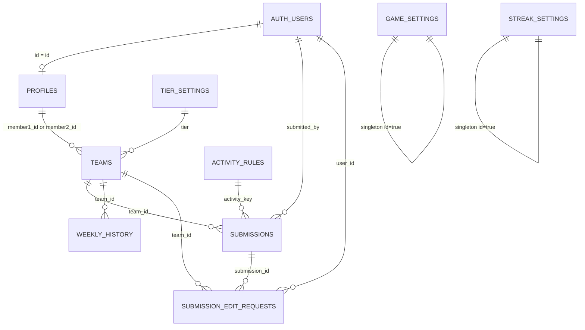

# Data Model

> **Purpose:** Document the complete database schema, relationships, and data policies.
> **Audience:** Developers, AI agents, database administrators.
> **Source of truth:** `supabase/migrations/`, application code queries, `lib/types.ts`.
> **Last reviewed:** 2026-09-03

## Schema Overview

The database is PostgreSQL hosted on Supabase. The schema is managed through SQL migration files run manually in the Supabase SQL Editor. There is **no Supabase CLI configuration file** (`supabase/config.toml`) in the repository — migrations are applied manually.

## Entity-Relationship Diagram

## Tables

### `profiles`

User profiles, synced from `auth.users`. Contains display information and admin flag.

| Column | Type | Nullable | Default | Description |
|--------|------|----------|---------|-------------|
| `id` | UUID | NOT NULL | — | PK, FK to `auth.users.id` |
| `first_name` | TEXT | YES | — | User's first name |
| `last_name` | TEXT | YES | — | User's last name |
| `email` | TEXT | YES | — | User's email |
| `is_admin` | BOOLEAN | YES | `false` | Admin flag |
| `created_at` | TIMESTAMPTZ | YES | `NOW()` | Account creation time |

**Used by:** `lib/admin.ts`, `lib/is-admin.ts`, `lib/cached-data.ts`, `app/teams/actions.ts`, `app/leaderboard/page.tsx`

**RLS:** `Inferred` — Not defined in migration files. Likely configured directly in Supabase dashboard. The `is_admin()` SQL function is referenced in RLS policies, suggesting a database function exists for this purpose.

**PII:** Contains `first_name`, `last_name`, `email`.

---

### `teams`

Two-person teams with competition tier.

| Column | Type | Nullable | Default | Description |
|--------|------|----------|---------|-------------|
| `id` | UUID | NOT NULL | `gen_random_uuid()` | PK |
| `name` | TEXT | NOT NULL | — | Team display name |
| `member1_id` | UUID | YES | — | FK to `auth.users.id` (team captain) |
| `member2_id` | UUID | YES | — | FK to `auth.users.id` (partner) |
| `member1_name` | TEXT | YES | — | Denormalized display name |
| `member2_name` | TEXT | YES | — | Denormalized display name |
| `invite_code` | TEXT | YES | — | 6-char uppercase code for joining |
| `weekly_points` | INTEGER | YES | `0` | Points earned this week |
| `total_points` | INTEGER | YES | `0` | Accumulated points from all finalized weeks |
| `weeks_won` | TEXT[] | YES | `'{}'` | Array of week identifiers won |
| `tier` | TEXT | YES | — | `CHECK (tier IN ('gold', 'purple', 'red'))` |
| `streak_count` | INTEGER | YES | `0` | Current consecutive days of activity |
| `last_activity_date` | DATE | YES | — | Date of last activity submission |
| `created_at` | TIMESTAMPTZ | YES | `NOW()` | Team creation time |

**Used by:** Leaderboard, submit, teams, admin pages.

**Constraints:**
- `member1_id != member2_id` (inferred from code comments)
- `tier CHECK IN ('gold', 'purple', 'red')`

**Cascade:** `ON DELETE CASCADE` from teams to submissions and weekly_history.

---

### `submissions`

Individual activity submissions by team members.

| Column | Type | Nullable | Default | Description |
|--------|------|----------|---------|-------------|
| `id` | UUID | NOT NULL | `gen_random_uuid()` | PK |
| `team_id` | UUID | NOT NULL | — | FK to `teams.id` |
| `submitted_by` | UUID | NOT NULL | — | FK to `auth.users.id` |
| `activity` | TEXT | NOT NULL | — | Display string (e.g., "running:5.2") |
| `activity_key` | TEXT | NOT NULL | — | References `activity_rules.activity_key` |
| `activity_date` | DATE | NOT NULL | — | Date of the activity (YYYY-MM-DD) |
| `base_points` | INTEGER | NOT NULL | — | Points before multipliers |
| `did_with_teammate` | BOOLEAN | NOT NULL | `false` | Whether done with teammate |
| `multiplier` | NUMERIC | NOT NULL | `1.0` | Admin multiplier (usually 1.0) |
| `points_awarded` | INTEGER | NOT NULL | — | Final computed points |
| `points_per_unit` | NUMERIC | YES | — | Snapshot of rule at time of submission |
| `teammate_bonus` | NUMERIC | YES | — | Snapshot of rule at time of submission |
| `activity_units` | NUMERIC | YES | — | Number of units (miles, games, etc.) |
| `activity_value_number` | NUMERIC | YES | — | Raw numeric input |
| `activity_value_text` | TEXT | YES | — | Raw text input |
| `activity_value_bool` | BOOLEAN | YES | — | Raw boolean input |
| `streak_bonus` | INTEGER | YES | `0` | Streak bonus (0 for normal, >0 for streak rows) |
| `proof_image_path` | TEXT | YES | — | Path in `submission-proofs` storage bucket |
| `inserted_at` | TIMESTAMPTZ | YES | `NOW()` | When submitted |

**Used by:** Submit actions, admin submissions, profile, leaderboard calculations.

**Database triggers:** `Needs maintainer confirmation` — The code references `trg_submission_points_delete` for team point updates on deletion.

---

### `activity_rules`

Admin-defined scoring rules for each activity type.

| Column | Type | Nullable | Default | Description |
|--------|------|----------|---------|-------------|
| `activity_key` | TEXT | NOT NULL | — | PK, unique identifier (e.g., "running") |
| `points_per_unit` | NUMERIC | NOT NULL | — | Points awarded per unit |
| `teammate_bonus` | NUMERIC | NOT NULL | — | Multiplier when done with teammate |
| `unit` | TEXT | YES | — | Unit type (legacy field) |
| `label` | TEXT | YES | — | Human-readable activity name |
| `input_type` | TEXT | YES | — | `'number'`, `'text'`, or `'boolean'` |
| `unit_label` | TEXT | YES | — | Display label for unit (e.g., "miles") |
| `min_value` | NUMERIC | YES | `0` | Minimum input value |
| `step_value` | NUMERIC | YES | — | Input step increment |
| `active` | BOOLEAN | YES | `true` | Whether activity is available for submission |
| `weekly_cap` | INTEGER | YES | — | Max points per team per week for this activity |
| `description` | TEXT | YES | — | Help text shown to users |
| `updated_at` | TIMESTAMPTZ | YES | — | Last update time |

**Used by:** `app/admin/scoring/`, `app/submit/actions.ts`, `app/submit/page.tsx`.

---

### `game_settings`

Singleton table controlling the competition state.

| Column | Type | Nullable | Default | Description |
|--------|------|----------|---------|-------------|
| `id` | BOOLEAN | NOT NULL | — | PK, always `true` (singleton pattern) |
| `registration_open` | BOOLEAN | NOT NULL | `true` | Whether teams can be created/joined |
| `submissions_open` | BOOLEAN | NOT NULL | `false` | Whether activities can be submitted |
| `games_started_at` | TIMESTAMPTZ | YES | — | When games were started |
| `games_ended_at` | TIMESTAMPTZ | YES | — | When games were ended |
| `finalize_requested` | BOOLEAN | NOT NULL | `false` | Flag that triggers week finalization |
| `last_week_finalized` | DATE | YES | — | Date of last finalized week |

**Database trigger:** `trg_finalize_previous_week` — AFTER UPDATE trigger that calls `finalize_week()` when `finalize_requested` changes to `true`.

---

### `tier_settings`

Weekly point goals for each competition tier.

| Column | Type | Nullable | Default | Description |
|--------|------|----------|---------|-------------|
| `tier` | TEXT | NOT NULL | — | PK, `CHECK (tier IN ('gold', 'purple', 'red'))` |
| `weekly_goal` | INTEGER | NOT NULL | `100` | Target weekly points |
| `created_at` | TIMESTAMPTZ | YES | `NOW()` | Creation time |
| `updated_at` | TIMESTAMPTZ | YES | `NOW()` | Auto-updated via trigger |

**RLS:** Public read, admin-only write (via `is_admin()` function).

**Trigger:** `tier_settings_updated_at` — auto-updates `updated_at` on UPDATE.

---

### `streak_settings`

Singleton table for streak bonus configuration.

| Column | Type | Nullable | Default | Description |
|--------|------|----------|---------|-------------|
| `id` | BOOLEAN | NOT NULL | — | PK, always `true` (singleton pattern) |
| `daily_bonus_increment` | INTEGER | NOT NULL | `1` | Points added per streak day |
| `max_bonus` | INTEGER | NOT NULL | `10` | Maximum streak bonus points |

**Used by:** `app/submit/actions.ts`, `app/admin/settings/streak-settings-actions.ts`.

---

### `weekly_history`

Historical record of team performance at end of each week.

| Column | Type | Nullable | Default | Description |
|--------|------|----------|---------|-------------|
| `id` | UUID | NOT NULL | `gen_random_uuid()` | PK |
| `team_id` | UUID | NOT NULL | — | FK to `teams.id` ON DELETE CASCADE |
| `week_identifier` | TEXT | NOT NULL | — | Format: "2026-W06" (ISO week) |
| `weekly_points` | INTEGER | NOT NULL | `0` | Points earned that week |
| `tier` | TEXT | YES | — | Team's tier at that time |
| `weekly_goal` | INTEGER | NOT NULL | — | Goal at that time |
| `met_goal` | BOOLEAN | NOT NULL | `false` | Whether team met their goal |
| `weeks_won_count` | INTEGER | NOT NULL | `0` | Snapshot of total wins |
| `streak_count` | INTEGER | YES | `0` | Team's streak at time of finalization |
| `created_at` | TIMESTAMPTZ | YES | `NOW()` | When record was created |

**Unique constraint:** `(team_id, week_identifier)`

**RLS:** Public read, admin-only write (via `is_admin()` function).

---

### `submission_edit_requests`

User-submitted requests to edit or delete past submissions.

| Column | Type | Nullable | Default | Description |
|--------|------|----------|---------|-------------|
| `id` | UUID | NOT NULL | `uuid_generate_v4()` | PK |
| `submission_id` | UUID | NOT NULL | — | FK to `submissions.id` ON DELETE CASCADE |
| `user_id` | UUID | NOT NULL | — | FK to `auth.users.id` ON DELETE CASCADE |
| `team_id` | UUID | NOT NULL | — | FK to `teams.id` ON DELETE CASCADE |
| `suggested_changes` | JSONB | YES | — | Structured change data |
| `reason` | TEXT | NOT NULL | — | User's explanation for the edit |
| `status` | TEXT | NOT NULL | `'pending'` | `CHECK (status IN ('pending', 'approved', 'rejected'))` |
| `created_at` | TIMESTAMPTZ | YES | `NOW()` | Request creation time |
| `updated_at` | TIMESTAMPTZ | YES | `NOW()` | Last update time |

**RLS:** Users can INSERT and SELECT their own requests. Admin access through service role key.

**Indexes:** `idx_submission_edit_requests_status`, `idx_submission_edit_requests_submission_id`

---

## Database Functions and Triggers

| Function/Trigger | Table | Type | Description |
|-----------------|-------|------|-------------|
| `finalize_week()` | — | Function | `Needs maintainer confirmation` — SQL function that handles per-tier winners, weekly history recording, points roll-up, weekly points reset |
| `trg_finalize_previous_week` | `game_settings` | AFTER UPDATE trigger | Calls `finalize_week()` when `finalize_requested` changes to `true` |
| `trg_submission_points_delete` | `submissions` | `Needs maintainer confirmation` — Referenced in code comments, handles team point updates on submission deletion |
| `update_tier_settings_updated_at()` | `tier_settings` | BEFORE UPDATE trigger | Auto-updates `updated_at` |
| `is_admin(user_id)` | — | Function | `Needs maintainer confirmation` — Used in RLS policies |
| `get_all_user_emails()` | — | RPC Function | Returns list of confirmed user emails |

> [!WARNING]
> The `finalize_week()` function, `trg_submission_points_delete`, and `is_admin()` function are **not defined in the migration files**. They exist in the Supabase database but were likely created directly via the SQL Editor. Their definitions should be exported and documented.

## Storage Buckets

| Bucket | Access | Purpose |
|--------|--------|---------|
| `submission-proofs` | Public read | Activity proof images uploaded by users |

## Migration History

Migrations are in `supabase/migrations/` and were run manually:

1. `add_team_tier.sql` — Added `tier` column to teams
2. `add_tier_weekly_goals.sql` — Created `tier_settings` table with defaults
3. `add_weekly_history.sql` — Created `weekly_history` table
4. `add_submission_edit_requests.sql` — Created `submission_edit_requests` table
5. `add_rls_policies.sql` — RLS for `tier_settings` and `weekly_history`
6. `20260223143500_add_structured_edit_requests.sql` — Changed `expected_values` TEXT to `suggested_changes` JSONB
7. `20260223203604_add_streak_bonus_activity.sql` — Added `daily_streak_bonus` activity rule
8. `20260223204946_fix_teammate_bonus_type.sql` — Changed `submissions.teammate_bonus` to NUMERIC

> [!IMPORTANT]
> The initial schema (profiles, teams, submissions, activity_rules, game_settings, streak_settings) is NOT in the migrations. It was created directly in Supabase and is only discoverable from application code queries.

## Change this document when…

- Tables, columns, or constraints are added or modified
- RLS policies change
- Database functions or triggers change
- New storage buckets are created
