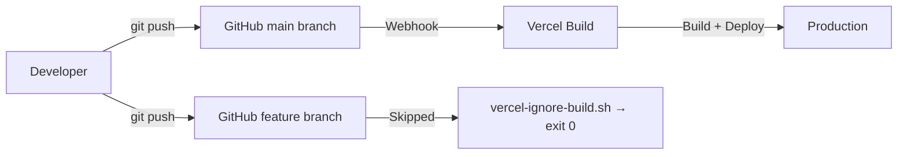

# Deployment

> **Purpose:** Document how code is deployed and production infrastructure is managed.
> **Audience:** Developers, DevOps, future maintainers.
> **Source of truth:** `vercel.json`, `vercel-ignore-build.sh`, `package.json`.
> **Last reviewed:** 2026-09-04

## Deployment Pipeline



### How Deployment Works

The repository is configured for Vercel and contains a branch-gating script. The Git integration, production branch, ignored-build command, domains, and plan are Vercel dashboard state and still require maintainer confirmation. If the script is configured as the ignored-build step, the intended flow is:

1. Developer pushes to `main` on GitHub
2. Vercel detects the push through its configured Git integration
3. `vercel-ignore-build.sh` checks the commit branch:
   - `main` branch → build proceeds (`exit 1`)
   - Any other branch → build cancelled (`exit 0`)
4. Vercel runs `npm run build` (`next build`)
5. Successful builds are deployed to production

### What Triggers a Deploy

| Trigger | Deploys? |
|---------|:--------:|
| Push to `main` | Intended to deploy; confirm dashboard integration |
| Push to feature branch | Script requests skip; confirm ignored-build setting |
| Pull request | Script requests skip for non-`main` refs |
| Manual Vercel dashboard deploy | Dashboard-dependent |

## Production URL

- Primary: `Needs maintainer confirmation` — likely `https://spartan-games.vercel.app`
- Custom domain: `Needs maintainer confirmation`

## Vercel Configuration

### `vercel.json`

```json
{
  "crons": [
    {
      "path": "/api/cron/finalize-week",
      "schedule": "0 6 * * 1"
    }
  ]
}
```

- **Weekly finalization cron:** Runs every Monday at 6:00 AM UTC
- Vercel sends a `GET` request to `/api/cron/finalize-week` with the `CRON_SECRET` in the Authorization header

### Environment Variables

All environment variables must be configured in the Vercel project dashboard:

**Settings → Environment Variables**

See [ENVIRONMENT_VARIABLES.md](./ENVIRONMENT_VARIABLES.md) for the complete list.

> [!IMPORTANT]
> Variables prefixed with `NEXT_PUBLIC_` are exposed to the client bundle. All other variables are server-only.

### Build Settings

| Setting | Value |
|---------|-------|
| Framework | Next.js (auto-detected) |
| Build Command | `npm run build` (default) |
| Output Directory | `.next` (default) |
| Install Command | `npm install` (default) |
| Node.js Version | Must satisfy Next.js: >=20.9.0 |
| Ignored Build Step | `vercel-ignore-build.sh` |

## Rollback

Vercel maintains deployment history. To rollback:
1. Go to Vercel Dashboard → project → Deployments
2. Find the last known good deployment
3. Click "..." → "Promote to Production"

## Cron Job

### Weekly Finalization

| Property | Value |
|----------|-------|
| **Schedule** | `0 6 * * 1` (Every Monday at 6:00 AM UTC) |
| **Endpoint** | `GET /api/cron/finalize-week` |
| **Authentication** | `Authorization: Bearer {CRON_SECRET}` |
| **Runtime** | Node.js (serverless function) |
| **Timeout** | Vercel plan/project setting; not configured in this repository |

**What happens when it runs:**
1. Validates `CRON_SECRET`
2. Calls `finalizeWeekService()` from `lib/finalize-week.ts`
3. Checks if games are active
4. Sets `finalize_requested = true` on `game_settings`
5. Database trigger `trg_finalize_previous_week` processes the finalization

**What can go wrong:**
- If `CRON_SECRET` is not set, endpoint is accessible without auth
- If the database trigger fails, `finalize_requested` may stay `true`
- If games haven't started or have ended, finalization is skipped gracefully
- Middleware currently requires a Supabase session for this path, so a normal bearer-only Vercel cron request is expected to redirect before the handler runs

### Manual Finalization

Two admin server actions can request finalization, but neither is currently imported by the Settings page. There is no rendered "Finalize Week" button in the current UI.

## Monitoring

There is **no monitoring infrastructure** configured:
- No Sentry or error tracking
- No Vercel Analytics
- No health check endpoint
- No alerting

Errors are only visible in:
- Vercel Function Logs (Vercel Dashboard → project → Logs)
- Server `console.log` / `console.error` output

## How to Deploy

### Standard Flow
```bash
git add .
git commit -m "your changes"
git push origin main
```

### If Build Fails
1. Check Vercel build logs in the dashboard
2. Common causes:
   - TypeScript type errors
   - Missing environment variables
   - Import resolution failures
   - Node.js runtime older than 20.9.0
3. Fix locally, push again

## How to Add a New Cron Job

1. Add a new API route in `app/api/cron/your-job/route.ts`
2. Export a `GET` handler that fails closed when `CRON_SECRET` is missing or invalid
3. Set `export const dynamic = "force-dynamic"` and `export const runtime = "nodejs"`
4. Add to `vercel.json`:
   ```json
   {
     "crons": [
       { "path": "/api/cron/your-job", "schedule": "your-cron-expression" }
     ]
   }
   ```
5. Redeploy
6. Exempt the exact endpoint from Supabase-session middleware (without making other protected routes public)
7. Test the deployed endpoint with no auth, bad bearer auth, and valid bearer auth

## Change this document when…

- Deployment provider changes
- Build pipeline changes
- New cron jobs are added
- Domain configuration changes
- Monitoring is added
