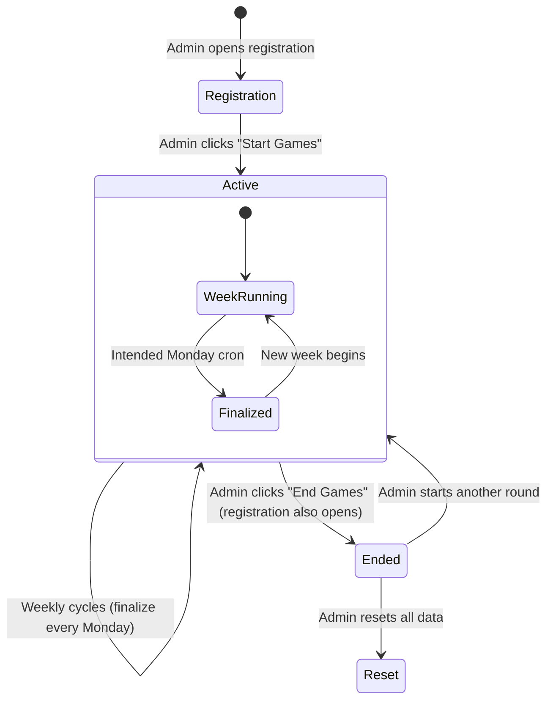

# Project Overview

> **Purpose:** Provide a complete understanding of what Spartan Games is, who it serves, and what it does.
> **Audience:** New developers, AI coding agents, and future maintainers.
> **Source of truth:** `README.md`, `app/layout.tsx`, `app/manifest.json`, all page/action files.
> **Last reviewed:** 2026-09-04

## What is Spartan Games?

**Spartan Games** is a web application that gamifies fitness and fraternity activities for SigEp (Sigma Phi Epsilon) fraternity members. Members form two-person teams, log physical activities (running, lifting, sports, etc.), and earn points. Teams compete on weekly and seasonal leaderboards across tiered divisions.

### Target Users

| Role | Description |
|------|-------------|
| **Member** | A fraternity member who creates an account, joins a team, and submits activities |
| **Admin** | A member with `is_admin = true` in the `profiles` table who manages the competition |

There are no other formal roles. Admin status is a boolean flag on the `profiles` table.

### Key Capabilities

1. **User Registration & Authentication** — Email/password flows via Supabase Auth; confirmation policy is configured outside the repository
2. **Team Management** — Create two-person teams with invite codes, select a competition tier (Gold/Purple/Red), rename, leave, change tier
3. **Activity Submission** — Log activities with date, type, units, optional proof photo, and teammate bonus
4. **Scoring Engine** — Points calculated from admin-defined `activity_rules` (points per unit × units × optional teammate bonus)
5. **Streak Tracking** — Consecutive daily activity bonuses tracked per team
6. **Weekly Leaderboard** — Request-time standings with tier filtering and progress bars toward weekly goals (no realtime subscription)
7. **Weekly Finalization** — Intended scheduled weekly cycle: records history, picks winners, rolls up points, resets weekly counters; current cron routing and missing SQL must be verified
8. **Admin Dashboard** — Six tabs: Activities (scoring rules), Submissions (review/edit/delete), Teams (manage/tier), History (weekly records), Notices (announcements via Slack/Email), Settings (game controls, goals, export, reset)
9. **Notifications** — Email (via Nodemailer/SMTP) and Slack webhook announcements
10. **Data Export** — Excel and CSV downloads for submissions and teams
11. **Web app manifest** — Includes standalone display metadata and app icons; there is no service worker or offline support
12. **Edit Requests** — Members can request edits to their submissions; admins approve/reject

### Competition Tiers

Teams are placed in one of three tiers at registration:

| Tier | Default Weekly Goal | Color |
|------|-------------------|-------|
| **Gold** | 100 points | Achievement/amber |
| **Purple** | 75 points | Primary/purple |
| **Red** | 50 points | Competition/red |

Weekly goals are configurable by admins via the `tier_settings` table.

### Competition Lifecycle

**Start Games:** Sets `registration_open = false`, `submissions_open = true`, records `games_started_at`. Optionally emails all users.

**End Games:** Sets `submissions_open = false`, `registration_open = true`, records `games_ended_at`. Optionally emails all users.

**Reset:** Deletes submissions and teams and attempts proof cleanup. The cleanup is not recursive even though proofs are stored in user folders, so nested files may remain. User accounts and activity rules are not deleted.

### Important Terminology

| Term | Definition |
|------|-----------|
| **Activity Rule** | An admin-defined activity type (e.g., "Running") with points_per_unit, teammate_bonus, input_type, unit, weekly_cap |
| **Submission** | A logged activity instance by a member, containing computed points |
| **Team** | A pair of members (member1 = captain, member2 = partner) competing together |
| **Tier** | Competition division (Gold/Purple/Red) determining weekly point goals |
| **Weekly Cap** | Maximum points a team can earn from a single activity type per week |
| **Teammate Bonus** | Multiplier applied when activity is done with teammate (e.g., 1.5x) |
| **Streak** | Consecutive days a team logs activity; awards bonus points via separate submission |
| **Finalization** | End-of-week process: records weekly_history, picks per-tier winners, rolls weekly_points into total_points, resets weekly_points to 0 |
| **Edit Request** | A member's request to modify or delete a past submission, reviewed by admin |
| **Invite Code** | Random 6-character code used to join an existing team |
| **Proof Image** | Optional photo uploaded with a submission, stored in Supabase Storage `submission-proofs` bucket |

### Non-Goals / Out of Scope

- No OAuth/social login (email/password only)
- No real-time WebSocket updates (page refresh or pull-to-refresh)
- No mobile native app (PWA only)
- No automated testing suite exists in the repository
- No internationalization (English only)
- No payment/subscription functionality

### Project Maturity & Known Unfinished Areas

- **`resetActivityRulesDefaults()`** is stub — redirects with "not_implemented" (`app/admin/scoring/actions.ts:138`)
- **`/app/protected`** directory exists but appears to be a legacy placeholder from the Next.js Supabase template
- **Slack commands** — `/api/slack/command` and `/api/slack/notify` are identical duplicates
- **`check_schema.js`** contains a hardcoded Supabase URL and publishable key (security concern)
- **`data.json`**, `dump.txt`, `out.txt`, `tsc_output.txt`, `dev_log.txt` — development artifacts committed to repo
- No configured test framework or repeatable automated test suite exists
- The initial database schema and critical trigger/function definitions are not versioned in migrations
- Vercel cron requests appear to be blocked by Supabase-session middleware before route authentication
- Manual finalization actions exist but are not connected to the Settings UI
- `/rules` and the submit-page rules modal are static copy, not generated from `activity_rules`
- Signed-out requests for `/manifest.json` are currently intercepted by authentication middleware

## Change this document when…

- The application purpose, user roles, or core features change
- New tiers or competition structures are added
- Major lifecycle changes are introduced
